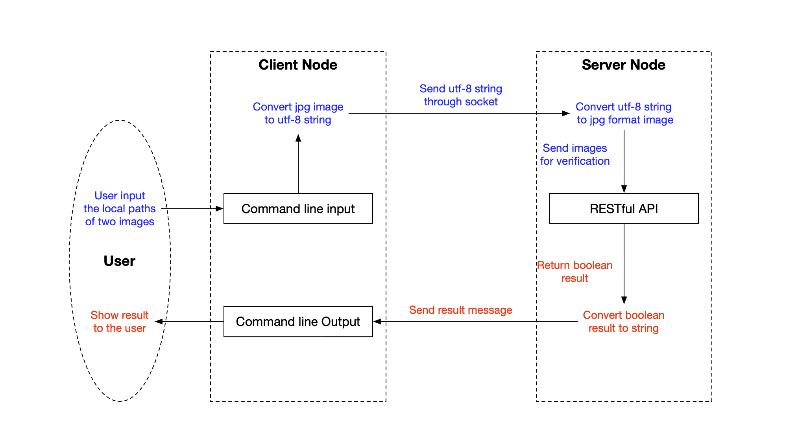

# CS655 Project #

## Demo & Reproduction ##

[Demo](https://github.com/LyapunovJingci/CS655_Project/blob/main/demo/Client_input_demo.mp4) of image verification

[Demo](https://github.com/LyapunovJingci/CS655_Project/blob/main/demo/Two_client_demo.mp4) of high load tesing

[Scripts](https://github.com/LyapunovJingci/CS655_Project/blob/main/server.sh) to setup server    

[Scripts](https://github.com/LyapunovJingci/CS655_Project/blob/main/client.sh) to setup client    

[Rspec file](https://github.com/LyapunovJingci/CS655_Project/blob/main/repec.xml)

### Reproduce Instruction ###

some useful command for the project:    
$ ps -fA | grep python    
$ sudo kill    

We've built two nodes in GENI, one for server, one for client.    

#### Steps（server ####  
1. Use the command line in [server.sh](server.sh) to install python and packages.    
2. Use ***sudo git clone https://github.com/LyapunovJingci/CS655_Project.git*** to clone the git code for this node (only the server.py is necessary for this node)    
3. Use ***cd CS655_Project*** to enter the folder.    
4. Use ***python3 server.py*** to run the server(need include sudo for the node)    
If you meet any problem when you are installing dlib, please try [this](https://stackoverflow.com/questions/56051515/opencv-python-building-wheel-for-dlib-setup-py).                         
If you use Python 3.6 to install everything, you should also install Python 3.6 for your client node(Although you can also use python 3.7 as well)    

#### Steps（client）####   
1. Use the command line in [client.sh](client.sh) to install python and packages.    
2. Use ***sudo git clone https://github.com/LyapunovJingci/CS655_Project.git*** to clone the git code for this node (the client.py, clientInput.py is necessary for our test, and the folder of image stored some images you could use for the test)    
3. Use ***cd CS655_Project*** to enter the folder.    
4. Use ***python3 clientInput.py*** to run the server   

## Introduction ##
The rapid development of image recognition in the past two decades has greatly transformed everyday life. With a tremendous boost of face recognition and verification demand, the server would face high load situations more and more frequently. In this project, we built a platform of face verification, and tested its accuracy as well as robustness of high demand. Our project allows a user to upload two images at one time, and the system would provide the information of whether these two belong to the same human. This project is a rudimentary demo, and it could be extended to real time face verification and be applied on different platforms. The main motivation of this project is to combine the computer network related knowledge that we have learned in this class with our own interest, at the same time, it allows us to explore new fields and technology stacks. 

In this project, we built a client and a server, and they would communicate through socket computing. The server side connected to a RESTful API based on the face_recognition package. The tests of this system could be divided into two parts: accuracy and robustness. For accuracy, we tested images with alternative directions. For robustness, we attempted to post multiple requests in a short period of time to simulate a high load situation. And during this procedure, we tested some basic parameters in the application layer, such as throughput. The project is finished using Python 3 and Flask(CGI).

## Methodology ##
On the client node, a user should upload two images here through the command line. After the user enters the paths of the images to be tested, the client will start connection with the server by Python socket programming. After receiving connection confirmation from the server, the client would begin to send these images. The client will convert each image into a utf-8 format string and then send it to the server one by one via Python socket programming. The client would wait for a response after every sending.

On the server node, when the server receives a message from the client, it will use a for loop with a decode function to convert these utf-8 strings into jpg format images. After decoding, the server would call a RESTful API for image verification. The API based on Face Recognition package was created with Python and Flask and deployed on the server node. Subsequently, the server would transfer the boolean result from the API to a string. At last, the server would send the message string back to the client node and the user would get the result of the verification. The client-server architecture diagram is shown below.

We used default VM for the project, and moreover, the ubuntu version is 18.04. To use the face_recognation, please make sure you are using Python>=3.6 and install cmake and dlib in your pc or node.

## Conclusion ##

In this project, we made a simple web application to compare the people in two pictures, if the face_compare judge that those two are the same people,  we will return true, otherwise, the application will return false. After that we used a while loop to repeat the sending process for one hundred times. We found that everything on the network may have an influence on the web application. Although our web application could also work in a bad situation(with high loss rate, high delay, and many users use the service at the same time). The speed would also be influenced by the bad situation, and sometimes the server will crash under the situation.  If possible, we would keep developing this application after this semester to improve the performance of that application.

## Reference ##

The RESTful API was build on the basis of [Face Recognition package](https://github.com/ageitgey/face_recognition)

The image data used for testing in this project is from [PubFig: Public Figures Face Database](https://www.cs.columbia.edu/CAVE/databases/pubfig/)

The specific image file path is [link](https://www.cs.columbia.edu/CAVE/databases/pubfig/download/dev_urls.txt)

"Attribute and Simile Classifiers for Face Verification," Neeraj Kumar, Alexander C. Berg, Peter N. Belhumeur, and Shree K. Nayar, International Conference on Computer Vision (ICCV), 2009.

   

## ✍️ Collaborators ##
- Qingyang Long [@CaptainDra](https://github.com/CaptainDra)
- Jingci Li [@LyapunovJingci](https://github.com/LyapunovJingci)
